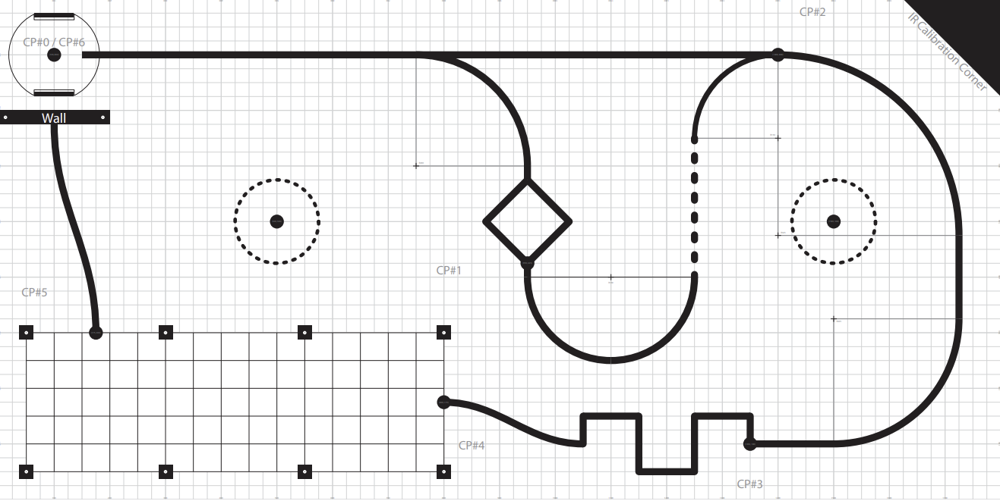

.. ME 405 Final Project documentation master file, created by
   sphinx-quickstart on Wed Dec 10 20:14:16 2025.
   You can adapt this file completely to your liking, but it should at least
   contain the root `toctree` directive.

Mechatronics Term Project Documentation
================================

This homepage outlines the hardware, drivers, state machine, and relevent diagrams and plots for the control of Romi for the Fall 2025 Mechatronics game track. All written code and documentation was completed by Emmi Cayer and Erin Maxwell. 

.. toctree::
   :maxdepth: 20
   :caption: Contents:

   hardware
   drivers
   state_machine
   taskandstatediagrams
   plots

Game Track
----

