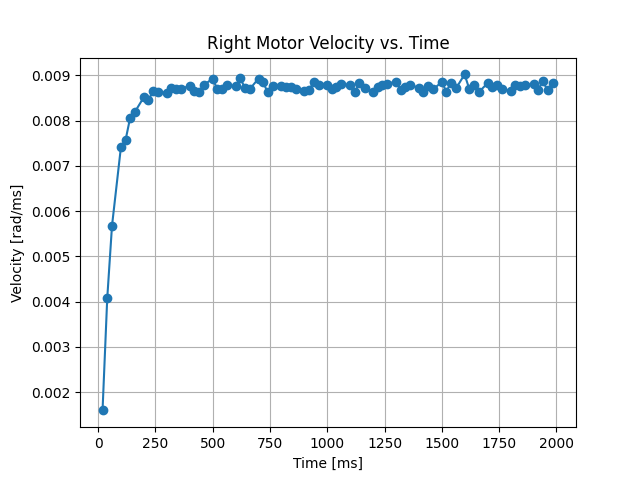

Encoder Plots
===============

We chose to impliment this motor in a parameterized fashion so it can be repurposed for any general PID controller use. In classical control theory, systems are seen as single-input-single-output (SISO) systems. Our controller takes a single input (an initial velocity) and outputs a single output (a final corrected velocity) through a PID controller, where P stands for proportional, I stands for integral, and D stands for derivative. These four plots show the encoder position and velocity values versus time for both the left and right motors. These were generated with use of our controllers while testing our gain values of Kp (proportional gain) and Ki (integral gain) with our final chosen values with a certain setpoint velocity value. 

Left Position
----
.. figure:: images/plot1_left_pos.png
   :align: center
   :height: 500px
   :alt: alternate text

Left Velocity
----
.. figure:: images/plot2_left_vel.png
   :align: center
   :height: 500px
   :alt: alternate text

Right Position
----
.. figure:: images/plot3_right_pos.png
   :align: center
   :height: 500px
   :alt: alternate text

Right Velocity
----

