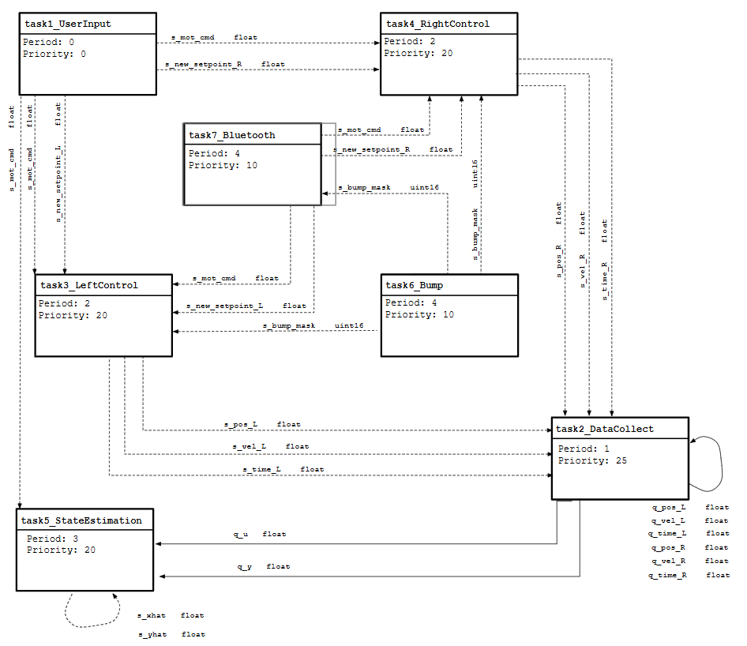
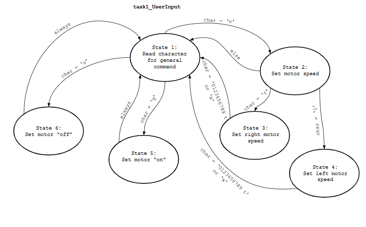
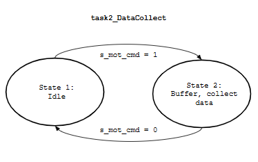
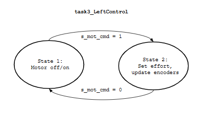
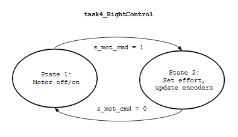
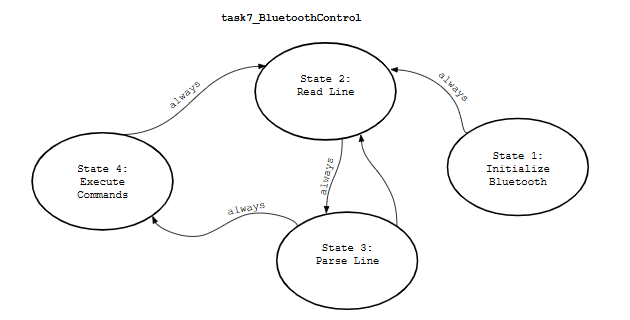
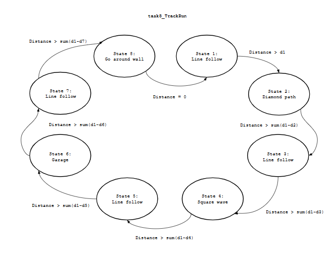

Task and State Diagrams
=================

Below are our task diagram for our overall code task structure as well as state diagrams showing the finite state machines for each task. 

Task Diagram
----

task1_UserInput State Diagram
----

task2_DataCollect State Diagram
----

task3_LeftControl State Diagram
----

task4_RightControl State Diagram
----

task6_BumpSensor State Diagram
----
.. figure:: images/task6_diagram.png
   :align: center
   :height: 500px
   :alt: alternate text

task7_BluetoothControl State Diagram
----

task8_TrackRun State Diagram
----

